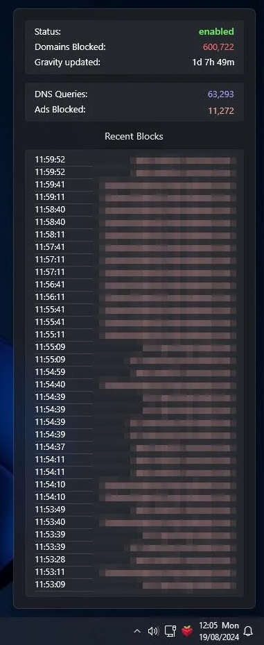
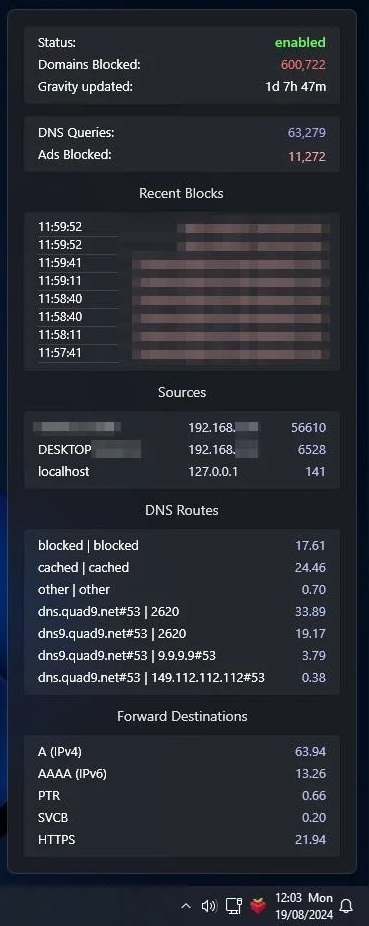
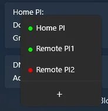

# Unofficial Pi-hole tray monitor for Windows
**Pihole Tray** is a system tray application for Windows that allows you to manage your Pi-hole instance(s) directly from your desktop. Easily toggle blocking and check statistics without needing to access the web interface.

## ✨ Features

- Easy setup
- Option to hide or show parts of the statistics
- Ability to disable or enable Pi-hole
- Background styles: Mica, Acrylic, Opaque
- It can be pinned
- Option to start on login
- Support for multiple instances *(Click on "Status:" to add more instances)*
- Supports **Pihole V5 and V6**
- Dark and light mode
- Instance modifying, deleting
  
## Screenshots

 

## 🚀 Planned features
- "View all" menu for aggregated statistics
#### After v6 release:
- Gravity update
- Whitelisting blocked domains
- System information (temp and etc.)

## 🤝 Contributing
Contributions are welcome! If you have an idea for a feature or find a bug, please open an [issue](https://github.com/PinchToDebug/Pihole-Tray/issues) or submit a [pull request](https://github.com/PinchToDebug/Pihole-Tray/pulls)!

## 📝 Important
The project is under development and could have bugs.\
To remove an instance go to **Computer\HKEY_CURRENT_USER\Software\Pihole_Tray** in the Registry Editor and delete the instance (this will change in the future).

## ⚠️ Disclaimer

This project is not affiliated with the Pi-hole project or its developers. This tool is a third-party application developed independently.

## 📜 License

This project is licensed under the MIT License. 
The project is built using [WPF UI](https://github.com/lepoco/wpfui), which is licensed under the [MIT License](https://github.com/lepoco/wpfui/blob/main/LICENSE).
